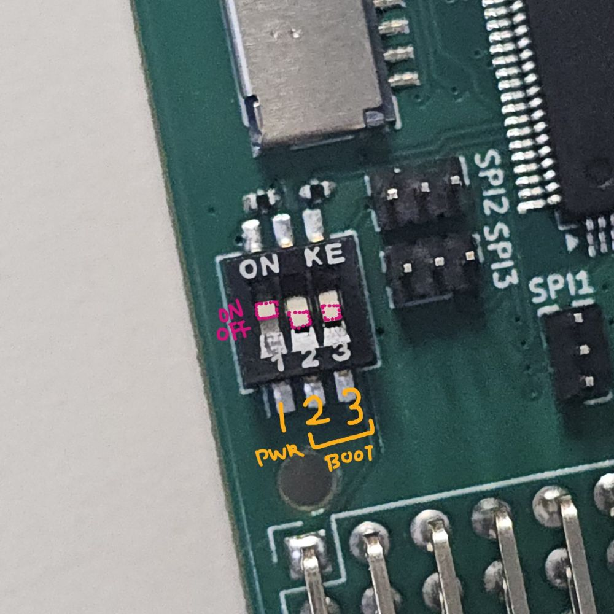
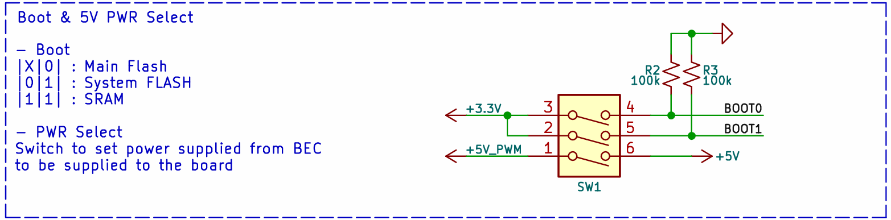
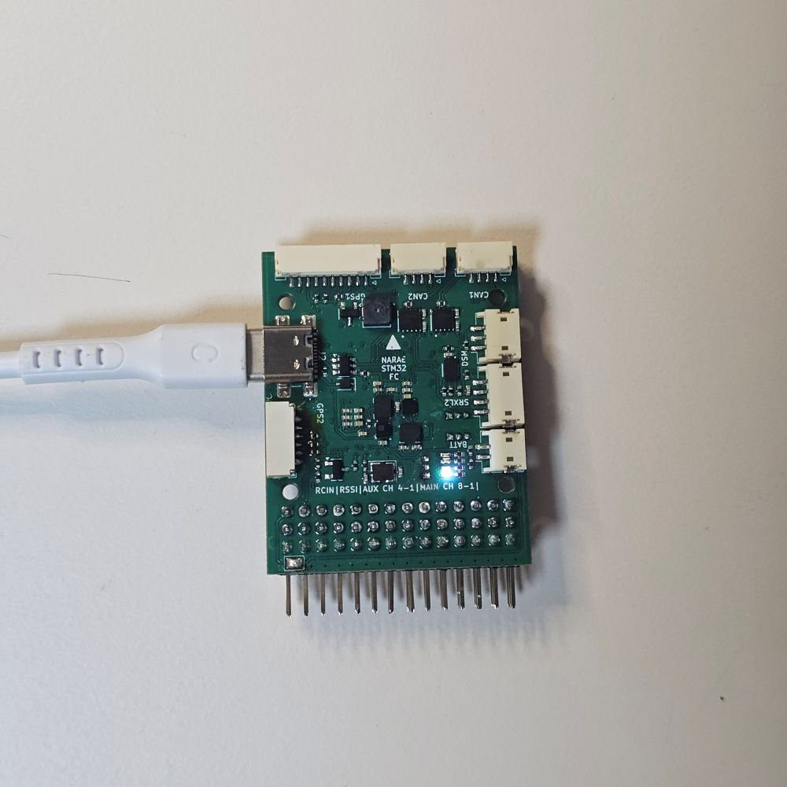
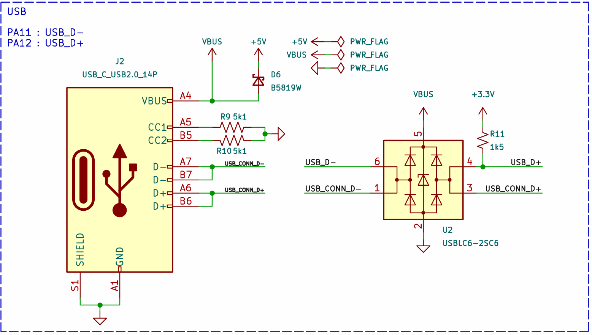
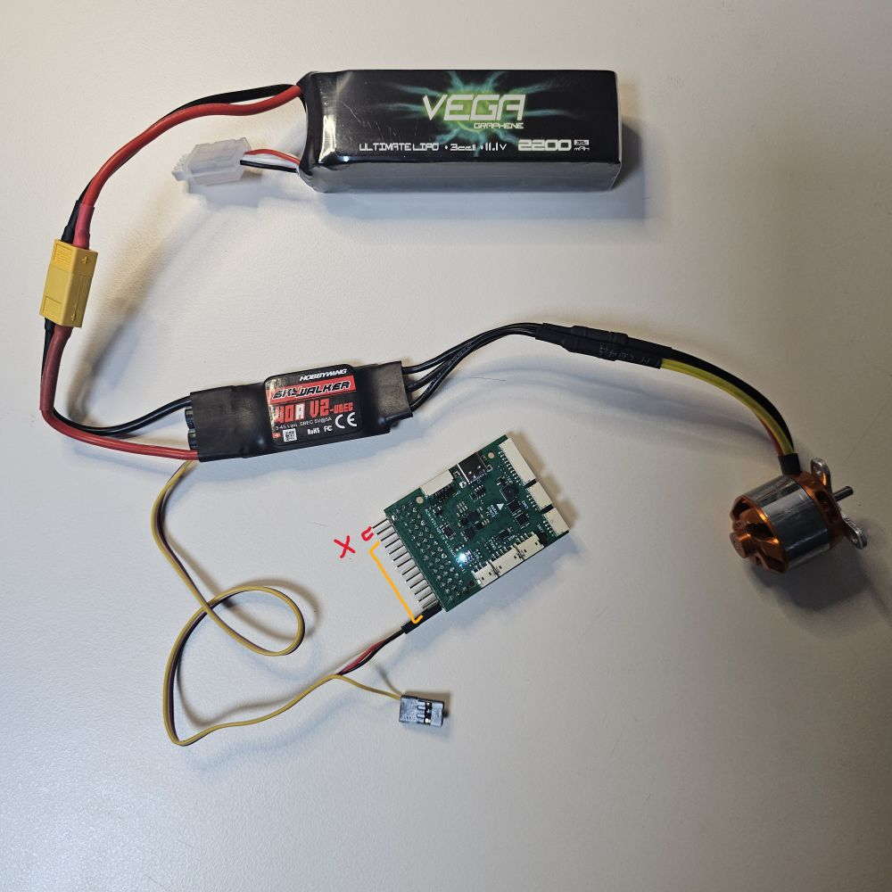
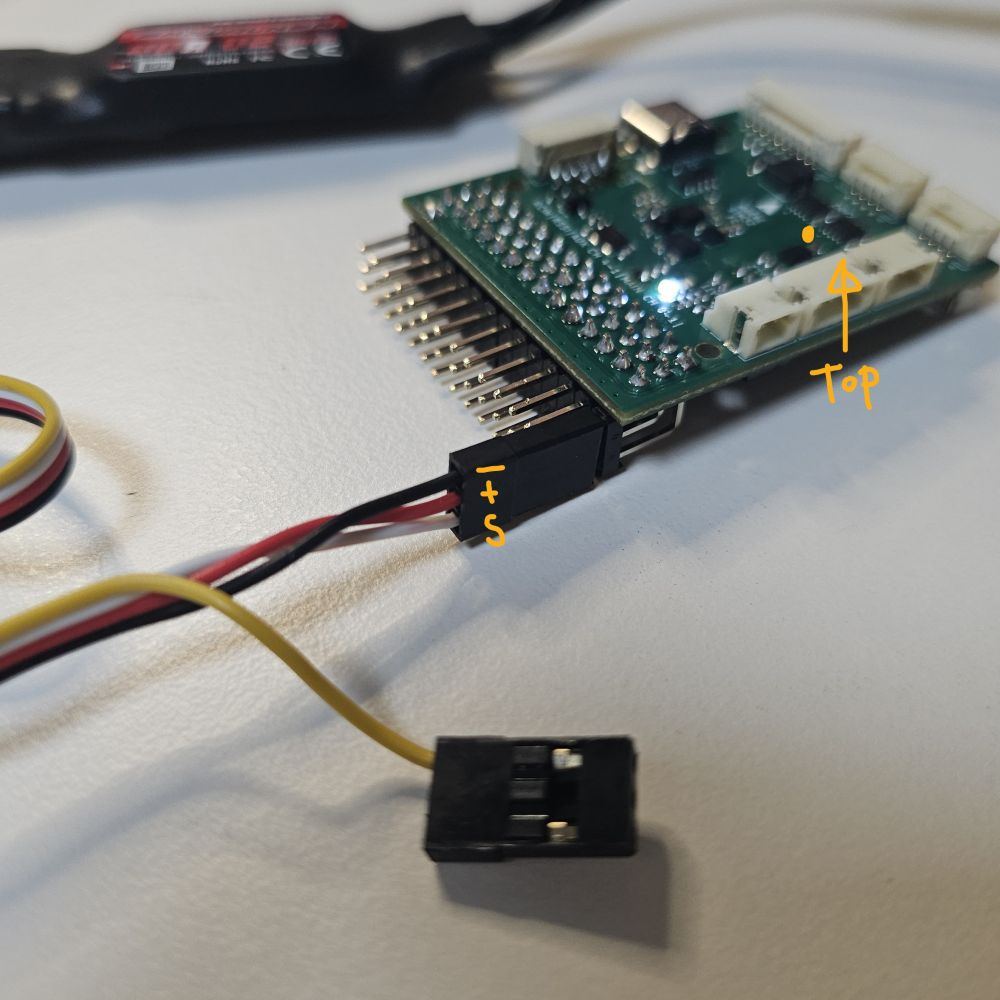

# 3. 전원 공급시 주의사항

| **보드는 USB 제외한 하나의 전원으로부터 5V를 공급 받아야 한다.**

보드는 `5V` 라인과  `5V_PWR` 라인으로 나뉜다.
- `5V` 라인은 칩셋과 센서 등 내부 장치와 GPS, 텔레메트리 등 외부장치를 구동한다.
- `5V_PWR`은 ESC와 서보모터 등 `SERVO OUT` 핀에 연결되어 있다.
- 일반적으로 `5V`와 `5V_PWR`은 분리되어 있으나, 필요에 따라 스위치를 통해 연결할 수 있다. 이 경우 둘 이상의 전원이 발생하지 않도록 유의한다.

스위치 1번이 두 전원 라인을 연결하는 데 사용한다. 일반적으로 `OFF` 상태가 기본값이다. 

- ON : 연결
- OFF (Default) : 차단

보드에서 `SERVO OUT` 측 기기로 전원을 공급하거나, `SERVO OUT`에 연결된 ESC로부터 전원을 공급 받을 때 `ON`으로 변경한다.

아래는 전원을 공급하는 세가지 방법에 대해 설명한다.

## 1. USB를 통한 공급 (개발용)

USB를 통해 전원을 공급할 수 있다. 이 경우에 다음 사항에 유의해야 한다.
- **USB A to C 케이블만 사용 가능**
  - Rev. 1 버전에서는 CC1, CC2 저항에 문제가 있어 USB C to C로 전원 공급이 되지 않는다.
- 고부하 사용 금지

USB 선을 통해 공급할 수 있는 전력의 한계가 있으므로, 별도의 전원 없이 다수의 서보 모터를 구동하면 보드가 손상될 수 있다.

USB 포트에서 공급되는 `VBUS`는 쇼트키 다이오드를 통해 `5V` 로 공급되므로 타전원과 같이 사용할 수 있다. 또한 USB는 CDC(Communication Device Class)를 지원하여 별도의 USB Serial Conveter 없이 컴퓨터와 통신 할 수 있다.

별도의 배터리가 필요 없어 개발 과정에서 유용하지만, 비행할 수 없으므로 후술할 방법도 익혀야한다.

## 2. 픽스호크의 파워모듈을 통한 공급 (권장)

픽스호크(Pixhawk)사의 파워모듈을 통해 전원을 공급하는 것으로 가장 안전하므로 권장하는 방법이다. 

픽스호크에는 다양한 파워모듈이 존재하며, 이중 **아날로그 모듈**을 사용해야 한다. 예를 들어 `PM02`와 `PM02D`에서 PM02D는 디지털 버전이므로 사용할 수 없다. 두 모델은 연결 커넥터가 다르므로 혼용할 가능성은 없다.

권장하는 모델은 다음과 같다.
- 1개의 ESC와 모터를 사용하는 단발 고정익기인 경우 : PM02
- 2개 이상의 ESC를 사용하는 고정익기 또는 멀티콥터 : PM06

파워 모듈은 보드의 `POWER` 커넥터에 연결한다.

## 3. ESC를 통한 공급

BEC가 내장된 ESC로부터 전원을 공급받는 방법으로, 가장 간단하나 주의가 요구된다.

- 5V BEC 내장 ESC만 사용
- BEC가 내장된 ESC는 하나만 사용
- 스위치 1번을 ON 상태로 조정한다.
- PWM 단자 중 왼쪽 두 개는 사용하면 안됨.
- PWM 단자는 나래 로고를 상단면으로 할 때, - + ~ (GND, 5V_PWR, Signal) 순서임.

이 방법은 단발 고정익 이나 회전익 기체에만 사용할 수 있다.
즉, 둘 이상의 ESC와 모터를 사용하는 고정익기 또는 멀티콥터는 반드시 파워 모듈을 사용해야 한다. 

PWM 단자 중 왼쪽 두 개는 `RCIN`과 `RSSI` 이므로 사용하면 안된다. `AUX`과 `MAIN`의 `SERVO OUT`에 연결하여 사용한다.

